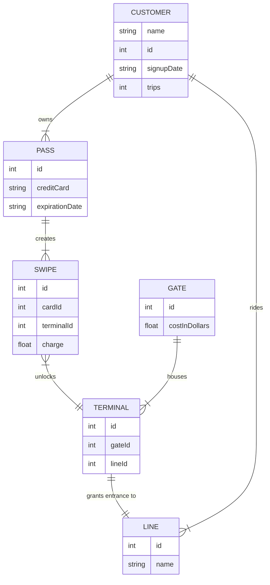

# Subway System

## Background
A subway system wants to model how their customers are getting around. A line is an underground path that connects terminals together. The company has different gates, each of which houses one or more terminals. Each terminal leads to a line.

Customers can enter a terminal and swipe their pass, which will grant them access to the line. To exit the line, usually at a different terminal, customers swipe their pass again. Eventually, a pass expires, so some customers might have multiple passes.

## Customer

Represents a client of the subway system. A customer has passes that they can swipe at gates.

This is important because the company needs to be able to connect various data points about their customers.

## Pass

A pass can be swiped at a terminal, granting the customer access and incurring a charge on the pass's customer's credit card.

This is important because the company needs to keep track of how customers are moving around.

## Swipe

A swipe keeps track of a pass, the terminal the pass was swiped at, and charge.

This is important because the company needs to see how much money they're recieving and how often customers are visiting terminals.

## Gate

A gate connects to one or more terminals, one for each line the gate sits on.

This is important because the company needs to know all the places customers can enter and/or exit terminals and lines.

## Terminal

A terminal connects directly to a single line and can be accessed from a single gate.

This is important because the company needs to know how different lines can be reached.

## Line

A line connects multiple terminals together.

This is important because the companies needs to know how all the different gates and terminals relate and how customers can travel from one place to another.